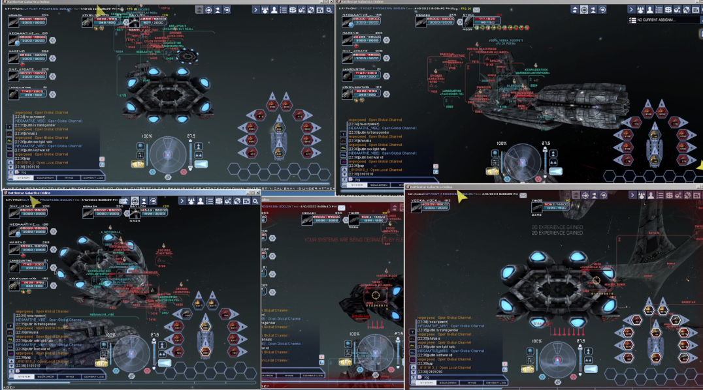
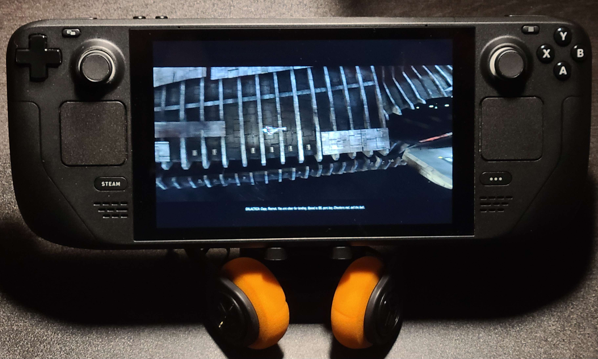

# BSGO on Linux in 2023!
**BSGO on Linux doesn't work?** Oh really?

BSGO on Linux is alive and it is a lot of fun. I'll show you:



This was on PopOS, Mementomori's server, but I've tested everything on many Debian- and Arch-based distros and it works very well.



Rubacuori's Steam Deck working nicely, Mementomori's server.


## Compatibility overview
**The BSGO client always works with WINE!** It's very easy to set it up!

For Linux support, the custom launchers pose the greatest and pretty much the only barrier to full Linux support.

BSGO server|Launcher works with WINE|Temporary workaround|Linux support planned?
--|--|--|--
[Mementomori](https://discord.gg/jsGGZZZ9xu)|<font color=FF7F50>limited</font>|PM me|<font color=DC143C>confirmed by Xulek</font>
[2.0 Resurrection](https://discord.gg/fhxpcb4SEr)|<font color=FF7F50>limited</font>|<font color=DC143C>no</font>|<font color=7FFF00>confirmed by Cavil</font>

**Notes:**
- This info might change, as both servers are undergoing active development. I will do my best to keep this information up-to-date.
- While Mementomori's launcher usually runs on admin privileges on Windows (which is bad), it does not need admin privileges running over WINE. However, **do not run it as `sudo`!** Ever.

## Requirements
- An x86-64 CPU (Intel or AMD). ARM workarounds are not discussed here
- An up-to-date system with drivers installed

## Instructions
1. **Enable 32-bit architecture.** This is because the BSGO client contains some 32-bit executables. By default, modern Linux distributions block the execution of 32-bit code for security reasons and for "cleanness". But we're not clean, we're playing a very old game. Hence, we need to enable 32-bit.
2. **Update & upgrade system.** This is to ensure that your system fetches 32-bit configurations.
4. **Install WINE.** In this guide, we will be installing a package called `winetricks`, which contains everything we need for BSGO.

### Instructions by Platform
- [Debian-based](Distros/Debian.md) (Ubuntu, Linux Mint, PopOS, ...)
- [Arch-based](Distros/Arch.md) (Arch, Manjaro, ElementaryOS, ArcoLinux, ...)
- [Steam Deck+SteamOS](Distros/SteamDeck.md)

For other platforms, find out how to perform steps 1-4 on your own.

## Testing your setup
1. **Launch BSGO client.** For example:
```bash
wine64 ./client/live/bsgo.exe
```
If it says "Please start the game using the Launcher", it means your setup is complete.

2. **Find out how to launch the launcher.** The launchers are the worst part of Linux compatibility. For example, try:
```bash
wine64 ./Launcher.exe
```

If you can launch the launcher, you're good to go. Otherwise, you might need some extra steps.

## Known Bugs on Linux
BSGO tends to work very well on Linux. However, you may encounter some of the following issues:

- You cannot enter the name for your character. In truth, you can - but the text you enter will be invisible.
- Ping is - (you can't see your ping)

This is a non-exhaustive list.


## Potential Issues
### Hybrid Graphics
Hybrid graphics, especially on Intel CPUs and NVIDIA GPUs, seems to cause problems for linux compatibility. If you receive cryptic Vulkan errors after launching `wine64 ./bsgo.exe`, you might want to force your dedicated GPU to run.

For NVIDIA GPUs, make sure that your drivers are installed and up-to-date. Also, make sure that `prime-run` is installed:

```sh
prime-run 'wine64 ./bsgo.exe'
```

`prime-run` forces your NVIDIA GPU to run, which should boot up your game immediately.


